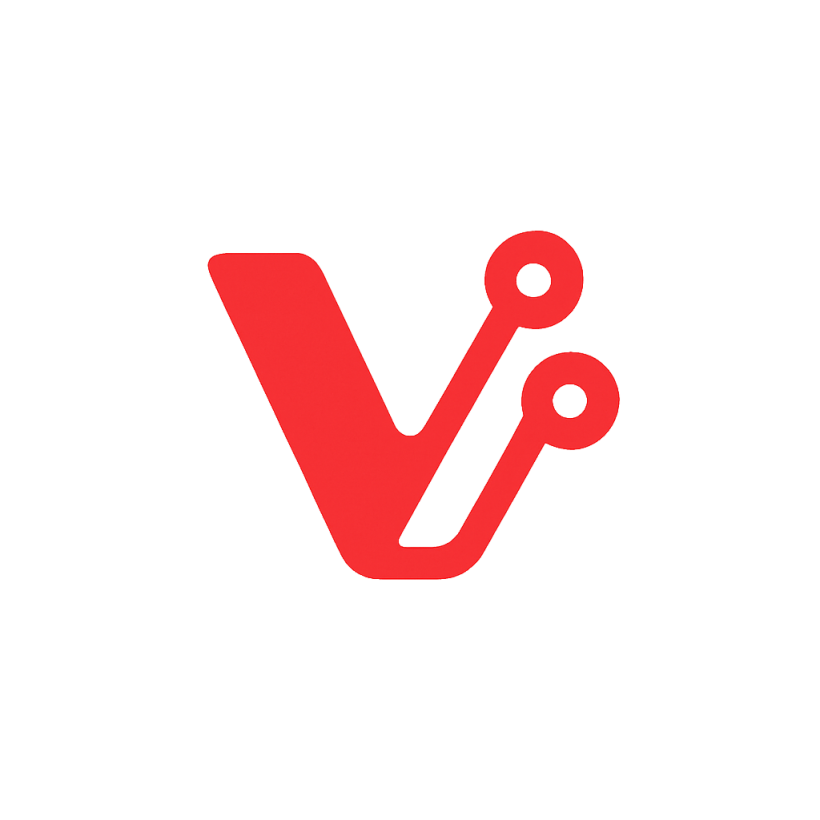

  
  <h1 style="display: inline; margin-left: -45px; vertical-align: middle;">VChatX</h1>

  
  
  
  
  
  
  

 

VChatX é uma plataforma white label para gestão de agentes de IA e instâncias inteligentes, com integração a ferramentas como Evolution API, n8n e outras. Ideal para criar, escalar e personalizar agentes autônomos com fluxos automatizados.

## �️ Sobre o Projeto

VChatX foi desenvolvido para empresas que precisam de uma solução completa e personalizável para automação de atendimento e gestão de agentes inteligentes. Nossa plataforma permite que você tenha controle total sobre a experiência do usuário, mantendo sua identidade visual e processos únicos.

## �🚀 Características Principais

- **🤖 Agentes Inteligentes**: Criação e gerenciamento de agentes de IA personalizados
- **📱 White Label**: Totalmente personalizável com sua marca e identidade visual
- **🔗 Integrações Poderosas**: Conecta com Evolution API, n8n, WhatsApp e outras plataformas
- **⚡ Automação Avançada**: Fluxos automatizados para otimizar processos de negócio
- **📊 Dashboard Completo**: Interface intuitiva para monitoramento e controle
- **🎯 Multi-instância**: Gerenciamento de múltiplas instâncias simultâneas
- **🔐 Segurança**: Autenticação robusta e proteção de dados

## � Como Funciona

1. **Configuração Inicial**: Configure sua instância com sua marca e preferências
2. **Criação de Agentes**: Desenvolva agentes inteligentes para diferentes propósitos
3. **Integrações**: Conecte com WhatsApp, Telegram e outras plataformas
4. **Automação**: Configure fluxos automáticos para diferentes cenários
5. **Monitoramento**: Acompanhe performance e resultados em tempo real

## 🎯 Para Quem é Destinado

- **Empresas de Atendimento**: Centralize e automatize seu suporte ao cliente
- **Startups**: Escale rapidamente sem investir em infraestrutura complexa
- **Comunidades e Organizações**: Ofereça para seus membros uma ferramenta poderosa de interação

## 🌍 Comunidades Parceiras

O VChatX cresce junto com a comunidade! Convidamos comunidades, grupos e organizações para serem nossos parceiros de crescimento:

### 🤝 Como Sua Comunidade Pode Contribuir

- **📢 Divulgação**: Compartilhe o VChatX com seus membros e seguidores
- **🧪 Testes Beta**: Seja o primeiro a testar novas funcionalidades
- **💬 Feedback**: Suas opiniões moldam o futuro da plataforma
- **📝 Conteúdo**: Crie tutoriais, casos de uso e documentação
- **🎯 Casos Reais**: Implemente o VChatX em seus projetos e compartilhe resultados

### 🎁 Benefícios para Comunidades Parceiras

- **🆓 Acesso Antecipado**: Novas funcionalidades antes do lançamento oficial
- **🏷️ Menção Especial**: Destaque da sua comunidade em nossos canais
- **📞 Suporte Direto**: Canal prioritário de comunicação conosco
- **🎨 Personalização**: Apoio na customização para necessidades específicas
- **📊 Insights**: Dados e métricas exclusivas para otimizar o uso

### 📬 Como Se Tornar uma Comunidade Parceira

Interessado em fazer parte dessa jornada? Entre em contato conosco:
- **📧 Email**: consultoria.vinditech@gmail.com

*Juntos construímos um ecossistema mais forte e inovador! 🚀*

## 🌟 Roadmap

### � Próximas Funcionalidades
    Em breve, teremos novas funcionalidades incríveis:

### 🔄 Em Desenvolvimento
    Em breve noticias sobre novas integrações e funcionalidades

## 🤝 Contribuindo

O VChatX é um projeto em constante evolução e sua contribuição é muito importante! Existem várias formas de ajudar:

### 💡 Sugestões e Ideias
- Abra uma issue com sugestões de melhorias
- Participe das discussões da comunidade

### 🐛 Reportando Problemas
- Use o sistema de Issues do GitHub para reportar bugs
- Descreva detalhadamente o problema encontrado
- Inclua screenshots quando possível

### 📝 Documentação
- Ajude a melhorar a documentação
- Traduza conteúdo para outros idiomas
- Crie tutoriais e guias de uso

## Forks e Contribuições

Você pode livremente fazer fork do repositório público do VChatX para estudar, modificar e propor melhorias via pull requests.

❗ **Atenção**: o uso da marca "VChatX" em forks públicos deve ser evitado sem autorização.
� **Importante**: Os módulos premium disponíveis para patrocinadores são de código fechado e não devem ser copiados ou redistribuídos.

## 🏆 Reconhecimentos

## 📝 Licença

Este projeto está sob a licença MIT. Veja o arquivo [LICENSE](LICENSE) para mais detalhes.

## 🆘 Suporte

- **🐛 Issues**: [GitHub Issues](https://github.com/Vinditech/VChatX/issues)
- **💬 Discussões**: Participe das discussões na comunidade para trocar ideias e tirar dúvidas

## 📈 Status do Projeto

---

  
⭐ Gostou do projeto? Deixe uma estrela e ajude outros a descobrirem o VChatX!

  
🚀 <strong>Transforme seu atendimento hoje mesmo!</strong>

